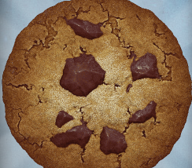

# Cookie Clicker - BOT

Um BOT para o jogo [Cookie Clicker](https://orteil.dashnet.org/cookieclicker/).

## • Argumentos

→ -i (Opcional): Define o período inicial que o BOT irá alocar clicando no Cookie principal.

  `sudo python main.py -i 10`
  
## • Ativando

Execute o script no arquivo **main.py**.

`sudo python main.py`

Caso necessário, instale os módulos requidos ao executar o script.

## • Configuração Inicial

Para o funcionamento correto do BOT, deve-se atender os seguintes requisitos:

1. O jogo deve estar aberto na tela do seu dispositivo.

2. A imagem do Cookie deve estar visível:

## • Inativando

Para inativar o BOT, pressione a tecla **"q"** até o final de um ciclo de cliques.
